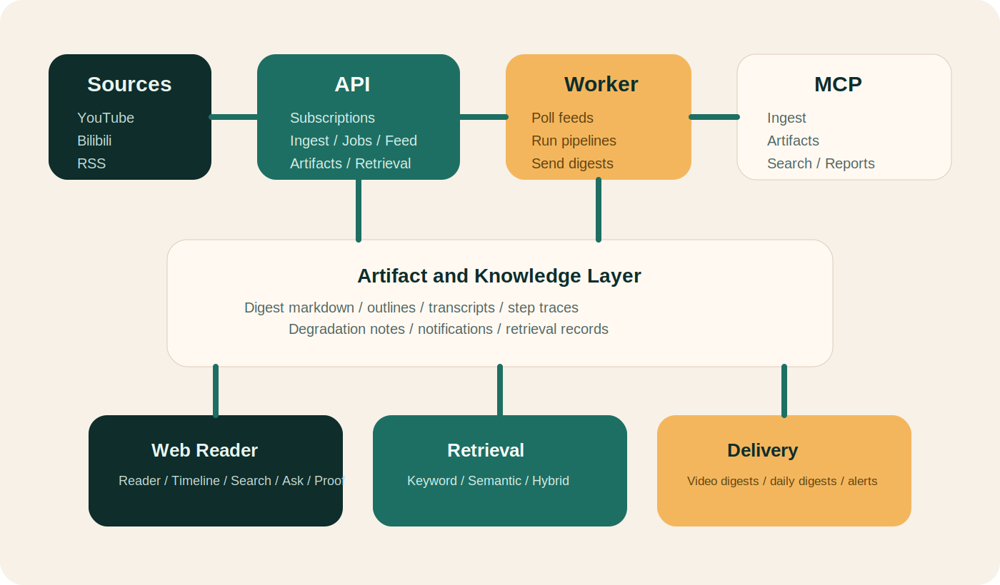

# Architecture

SourceHarbor is easiest to understand as a single knowledge pipeline with four outward-facing surfaces.

  

## The Product Model

Long-form sources come in through two honest intake lanes:

- **strong-supported video intake:** YouTube channels and Bilibili creators
- **generalized source intake:** RSSHub routes and generic RSS/Atom feeds
Artifacts, digests, merged stories, and traceable jobs come out.

Everything else in the repository exists to make that loop reliable, inspectable, and reusable.

## The Four Runtime Surfaces

### API

`apps/api` exposes HTTP endpoints for:

- subscriptions
- subscription template catalog shared by API, MCP, and the `/subscriptions` intake form
- ingestion
- videos and jobs
- digest feed
- artifacts
- retrieval
- notifications
- watchlists, briefing, and merged-story trend views
- reader pipeline endpoints for cluster verdict manifests, published reader documents, repair, and navigation brief
- operator-facing controls

### Worker

`apps/worker` runs the asynchronous pipeline:

- poll feeds into the pending-consume pool
- route entries into the video lane or article/text lane
- freeze consumption batches and process queued jobs
- judge batch clusters, materialize published reader documents, and carry yellow-warning / traceability companion payloads forward
- write artifacts
- send video digests
- send daily digests
- retry delivery failures

### MCP

`apps/mcp` exposes the same system as agent tools:

- ingest
- subscriptions
- jobs
- artifacts
- retrieval
- notifications
- reader documents and navigation brief
- reports
- UI audit hooks

### Web

`apps/web` is the operator command center:

- command overview
- reader frontstage for published reader documents
- proof boundary
- ops inbox / diagnostics
- watchlists, merged stories, trends, and unified briefings
- search plus story-aware, briefing-backed Ask front door that carries selected story context into answer, change, and evidence layers through a server-owned story page payload shared with `/briefings`, with one canonical selected-story object instead of front-end stitching or duplicate page aliases
- digest reading flow
- source contribution drawer and yellow-warning doc detail view
- ingest run ledger
- knowledge layer
- subscription management with strong-supported templates and generalized RSSHub/RSS intake, now driven by the shared subscription template catalog
- job trace
- notification settings
- sample playground
- use-case landing pages

## Shared Surfaces

- `contracts`: shared schemas and contract artifacts
- `infra`: compose, migrations, runtime infrastructure, and deployment assets
- `scripts` and `bin`: reproducible operator and CI entrypoints, including the runtime route snapshot under `.runtime-cache/run/full-stack/resolved.env`
- `./bin/sourceharbor`: thin repo-local CLI/help facade over those existing `bin/*` entrypoints

## Under Evaluation, Not Runtime Surfaces

Two directions are intentionally kept outside the current runtime surface:

- **Agent Autopilot**: SourceHarbor has workflows, MCP, retrieval, notifications, and evidence surfaces that can support a future spike, but it does not currently expose autonomous research ops as a product claim.
- **Hosted workspace**: SourceHarbor already has product-shaped front doors, but the repository still assumes source-first, local-proof-first operation rather than a managed multi-tenant service.

See:

- [2026-03-31-agent-autopilot-spike.md](./blueprints/2026-03-31-agent-autopilot-spike.md)
- [2026-03-31-hosted-readiness-spike.md](./blueprints/2026-03-31-hosted-readiness-spike.md)

## Design Principles

- **Result-first operations:** a newcomer should be able to produce a real job before reading deep internals
- **One truth, many surfaces:** API, MCP, and web all point at the same pipeline state
- **Strong lanes plus general lanes:** YouTube/Bilibili stay richer than the generalized RSSHub/RSS substrate, and the contract should say so plainly
- **Summary before diff before receipts:** unified briefings should lower operator cognitive load by leading with the current story, then the delta, then the drill-down evidence
- **Server owns the story page contracts:** `/briefings` and `/ask` should consume shared server-owned story selection, routes, and page payloads for the selected story, answer, changes, evidence, and next steps instead of recomposing those layers in the browser or keeping duplicate story aliases alive
- **Proof over promises:** jobs, artifacts, smoke scripts, and CI back up public claims
- **Supervisor truth before long live smoke:** the repo-managed local path is `bootstrap -> up -> status -> doctor`; stricter provider-backed smoke is a separate lane, not the same claim
- **Thin public docs, rich executable source:** docs should direct people; source should prove the details

## Deferred Directions

Two directions remain explicitly outside the current runtime surface:

- Agent autopilot is still a human-approved spike, not a shipped autonomous loop.
- Hosted team workspace is still a readiness question, not a current product promise.

Those boundaries are deliberate. They protect the repository's source-first and local-proof-first contract until auth, isolation, approval, and remote-proof layers exist for real.

## Read Next

- [start-here.md](./start-here.md)
- [runtime-truth.md](./runtime-truth.md)
- [proof.md](./proof.md)
- [project-status.md](./project-status.md)
- [testing.md](./testing.md)
