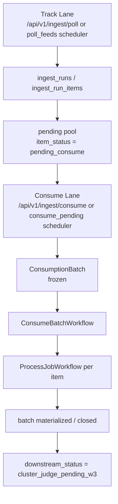

# 2026-04-09 Reader Product Lane Split Contract

状态：`W2-A` canonical lane-split contract。
用途：冻结 `Track Lane` / `Consume Lane` 的运行时边界、pending pool 语义、batch lifecycle 入口、以及 `W3` 之后需要继续消费的稳定 batch entrance。
边界：本文记录的是 **当前 repo 已经落地的 W2-A runtime 与仍留给 `W2-B / W3` 的边界**；不是把未来 reader-product 全链路误写成已完成。

依赖先读：

- `AGENTS.md`
- `docs/start-here.md`
- `docs/architecture.md`
- `docs/project-status.md`
- `docs/testing.md`
- `.agents/Tasks/TASK_BOARD-4月8日-阅读器产品与无损合并主线.md`
- `docs/blueprints/2026-04-08-reader-product-system-blueprint.md`
- `docs/blueprints/2026-04-09-reader-product-object-contract.md`
- `docs/blueprints/2026-04-09-reader-product-version-gap-contract.md`
- `.agents/Plans/2026-04-09__sourceharbor-W1-A-object-contract-closeout.md`
- `.agents/Plans/2026-04-09__sourceharbor-W1-B-version-gap-closeout.md`

谁应先读我：

- `W2-B` worker
- `W3-A cluster-judge` worker
- `W3-B merge-polish` worker
- 任意要判断“现在 batch 入口到底算不算稳定”的 reviewer / orchestrator

## 1. 本文职责与边界

这份文档解决的不是“reader-product 最终长什么样”，而是“Track 和 Consume 现在在运行时到底怎么分车道，后面谁应该接哪一段”。

说得更直白一点：

- `W1-A/W1-B` 像交通法和门牌规则
- `W2-A` 像把红绿灯、待转区和收费闸口装到真实道路上
- `W3` 才是后面真正把大货车开进 judge / merge / polish 主链

本文负责冻结：

1. 当前耦合点已经怎么拆开
2. `Track Lane` 的最小职责与禁止越界
3. `Consume Lane` 的最小职责与 runtime 入口
4. pending pool / batch assignment / close 语义
5. `manual` / `auto` consume guard
6. `window_id` / `cutoff_at` / batch freeze 在当前调用链里怎么落地
7. `W2-A` 与 `W2-B` 的文件边界
8. `W3` 现在可以直接建立在哪些稳定入口之上

本文明确不负责：

- direct URL / handle / 空间页 canonicalization
- 批量 URL UX
- `manual source intake` 的 front-door UI / API 实现
- `Cluster Judge` / `Merge Writer` / `Polish Writer` 逻辑实现
- `PublishedReaderDocument` reader UI
- yellow warning UI
- MCP published-doc tool 面

## 2. 与 `W1-A / W1-B` Contract 的关系

`W1-A` 已经冻结：

- 8 个核心对象
- `TraceabilityPack` companion payload 定位
- `manual source intake` 已经进入对象层

`W1-B` 已经冻结：

- `window_id = YYYY-MM-DD@IANA_TZ`
- `cutoff_at`
- `published_with_gap`
- yellow warning contract
- `TraceabilityPack` minimum schema
- incremental judge / affected-cluster rebuild rules

`W2-A` 在这些上游 contract 上负责的事情只有一件：

> 把“发现更新”和“冻结消费批次”从当前耦合实现里拆开，
> 并让 `ConsumptionBatch` 真正成为 runtime 入口，而不再只是文档名词。

当前真实边界是：

- `W2-A` **已经**把 Track 和 Consume 在 runtime 中拆成不同入口与不同 workflow
- `W2-A` **已经**把 `ConsumptionBatch` 和 pending pool 接进真实持久层
- `W2-A` **还没有**实现 `W3` 才拥有的 `judged` / merge / polish 主链

所以后续口径必须诚实：

- batch 边界已经稳定
- `W3` 不需要再回头争“什么叫一批”
- 但 `ClusterVerdictManifest` / `PublishedReaderDocument` 仍是 `W3` 以后才会真正 materialize 的对象

## 3. Track / Consume Split 的目标状态

当前 `W2-A` 已落地后的运行时心智应该这样读：

这里最关键的变化有两条：

1. `Track Lane` 不再在 `PollFeedsWorkflow` 里直接 child-dispatch `ProcessJobWorkflow`
2. `Consume Lane` 才会把 `pending_consume` 的 item freeze 成 `ConsumptionBatch`，然后统一调度处理

## 4. 当前耦合点证据

### 4.1 拆车道后的关键证据表

| 主题 | 当前锚点 | 读法 |
| --- | --- | --- |
| Track API 入口 | `apps/api/app/services/ingest.py:36-172` | `/api/v1/ingest/poll` 只创建 `IngestRun` 并启动 `PollFeedsWorkflow`，返回 track run ledger |
| Track workflow 不再 dispatch process child | `apps/worker/worker/temporal/workflows.py:33-54` | `PollFeedsWorkflow` 只执行 `poll_feeds_activity`，返回 `dispatched_process_workflows = 0` |
| Track 仍会发现 item 并创建 queued job | `apps/worker/worker/temporal/activities_poll.py:366-425` | poll 活动仍 upsert `videos` / `jobs`，但 item 状态写成 `pending_consume`，不在 workflow 层直接消费 |
| Consume API 入口 | `apps/api/app/routers/ingest.py:213-252` | `/api/v1/ingest/consume` 是新 manual/auto consume runtime 入口 |
| Consume service 编排 | `apps/api/app/services/ingest.py:175-327` | service 会做 timezone、cooldown、batch prepare、workflow start |
| Consume pending scheduler | `apps/worker/worker/temporal/workflows.py:158-193` | `ConsumePendingWorkflow` 负责 loop 模式下按 `>= 60m` 节奏自动 consume |
| Consume batch runner | `apps/worker/worker/temporal/workflows.py:63-156` | `ConsumeBatchWorkflow` 负责 freeze 后的 per-item processing 与 batch closeout |

### 4.2 这张表说明什么

- 以前的世界是“poll 完就顺手消费”
- 现在的世界是“poll 只发现，consume 才冻结并消费”

也就是说，老耦合点已经不是 current runtime truth 了；它已经被新的 batch entrance 替代。

## 5. Track Lane Minimum Responsibilities

当前 `Track Lane` 的最小职责已经可以正式写成：

1. 发现新 `SourceItem`
2. upsert `videos`
3. 建立 `ingest_runs / ingest_run_items` track ledger
4. 创建后续可消费的 queued job
5. 把 item 状态写成 `pending_consume`
6. 支持 one-shot poll 和 loop scheduler 两种 runtime 入口

对应锚点：

- `apps/worker/worker/temporal/activities_poll.py:294-445`
- `apps/api/app/models/ingest_run.py:69-128`
- `apps/worker/worker/main.py:161-221`
- `apps/api/app/schemas/workflows.py:43-48`

`Track Lane` 明确不能做的事：

1. 不直接 child-dispatch `ProcessJobWorkflow`
2. 不直接创建 `ConsumptionBatch`
3. 不越权决定 merge / polish 主链
4. 不直接 materialize `PublishedReaderDocument`

一句话：

> `Track Lane` 现在更像“收件室 + 待处理登记台”，
> 而不是“看到新包裹就当场拆箱、组装、再上架”的流水线。

## 6. Consume Lane Minimum Responsibilities

当前 `Consume Lane` 已接上的最小职责是：

1. 选择 pending pool 中可消费的 item
2. 解析 / 固定 `window_id`
3. 计算 / 固定 `cutoff_at`
4. 创建 `ConsumptionBatch`
5. 把选中的 item 从 `pending_consume` 推进到 `batch_assigned`
6. 启动 `ConsumeBatchWorkflow`
7. 逐 item 调 `ProcessJobWorkflow`
8. 把 batch 推进到 `materialized -> closed`
9. 显式留下 `downstream_status = cluster_judge_pending_w3`

对应锚点：

- `apps/api/app/services/ingest.py:175-327`
- `apps/worker/worker/state/postgres_store.py:521-784`
- `apps/worker/worker/temporal/activities_entry.py:135-196`
- `apps/worker/worker/temporal/workflows.py:63-193`

这里要诚实强调一件事：

> 当前 `Consume Lane` 已经建立了稳定 batch entrance，
> 但它并没有冒充 `W3` 去假装完成 `Cluster Judge / Merge / Polish`。
> 现在它做的是：把批次冻结、把单 item 处理链吃完、把后续入口稳定交给 `W3`。

## 7. pending pool / assignment / close semantics

### 7.1 当前采用的表达方式

这轮没有另造一套“待消费池大对象”，而是采取了：

- **复用现有 `ingest_run_items` 作为 pending pool ledger**
- **新增 `consumption_batch_items` 作为 freeze snapshot**

这套表达方式的好处很像“仓库收货单 + 装车清单”的组合：

- `ingest_run_items` 负责告诉你“货到了没、现在在哪个阶段”
- `consumption_batch_items` 负责告诉你“这次发车具体装了哪些货”

### 7.2 最小状态语义

`ingest_run_items.item_status` 现在至少支持：

- `pending_consume`
- `batch_assigned`
- `closed`
- `deduped`
- `skipped`

对应锚点：

- `apps/api/app/models/ingest_run.py:69-128`
- `infra/migrations/20260409_000018_consumption_batches.sql:4-15`
- `apps/worker/worker/temporal/activities_poll.py:376-393`
- `apps/worker/worker/state/postgres_store.py:761-784`
- `apps/worker/worker/state/postgres_store.py:952-1006`

### 7.3 当前 pending pool 选择规则

当前 `prepare_consumption_batch` 选择 pending item 的规则是：

1. `ingest_run_items.item_status = pending_consume`
2. `job_id IS NOT NULL`
3. 对应 `jobs.status = queued`
4. `consumption_batch_items` 里还没有 assignment
5. 选择同一 `window_id` 的一组 item freeze 成一批

对应锚点：

- `apps/worker/worker/state/postgres_store.py:521-784`

这件事对 `W3` 很重要，因为它意味着：

- pending pool 的来源和边界都已经明确
- `W3` 以后不需要再自己发明“这批 raw docs 从哪来”

## 8. `manual` / `auto` consume guard

### 8.1 当前已落地的 guard

当前 `Consume Lane` 的入口已经同时支持：

- `manual`
- `auto`

并且当前 guard 是 fail-close 的：

- `manual`：默认模式，不受 cooldown 阻断
- `auto`：必须先检查最新 batch 的 `cutoff_at`
- 若距离上一次 batch 不到 `60` 分钟，则返回 `cooldown_blocked`

对应锚点：

- `apps/api/app/services/ingest.py:190-247`
- `apps/worker/worker/temporal/workflows.py:163-193`
- `apps/api/app/routers/ingest.py:45-66`

### 8.2 Track interval 的真实 runtime 入口

`Track = 15 minutes` 现在不再只是文档默认值，它已经进入真实 runtime 参数面：

- `PollFeedsWorkflow` loop 模式会按 `interval_minutes` sleep
- worker CLI `start-poll-workflow --continuous --interval-minutes 15`
- workflow payload schema 允许 `poll_feeds.interval_minutes`

对应锚点：

- `apps/worker/worker/temporal/workflows.py:33-54`
- `apps/worker/worker/main.py:161-221`
- `apps/worker/worker/main.py:542-598`
- `apps/api/app/schemas/workflows.py:43-86`
- `apps/api/app/routers/workflows.py:29-35`
- `apps/mcp/tools/workflows.py:19-79`

## 9. batch lifecycle 如何进入运行时

当前真实 batch lifecycle 是：

1. `frozen`
   - `prepare_consumption_batch` 插入 `consumption_batches`
   - 选中的 item 进入 `batch_assigned`
2. `materialized`
   - `ConsumeBatchWorkflow` 跑完本批 item 的 `ProcessJobWorkflow`
   - 写入 per-batch process summary
3. `closed`
   - batch close
   - 对应 `ingest_run_items.item_status = closed`
4. `failed`
   - 若 batch 处理失败，回滚 item 到 `pending_consume`

对应锚点：

- `apps/worker/worker/state/postgres_store.py:521-784`
- `apps/worker/worker/state/postgres_store.py:843-1006`
- `apps/worker/worker/temporal/workflows.py:63-156`

### 当前诚实边界

这轮没有把 `judged` 假装成已 runtime-implemented。

当前真实读法应该是：

- `W2-A` 已落地：`frozen -> materialized -> closed`
- `W3` 将在这个 stable batch entrance 之上接入真正的 `judged` / merge / polish 主链
- 当前代码通过 `downstream_status = cluster_judge_pending_w3` 明确把这个 handoff 暴露出来

对应锚点：

- `apps/worker/worker/temporal/workflows.py:109-141`

## 10. shared ownership / file boundaries

### `W2-A` 当前 ownership

本轮实际触达并与 lane split 直接相关的路径：

- `apps/api/app/models/ingest_run.py`
- `apps/api/app/models/consumption_batch.py`
- `apps/api/app/repositories/consumption_batches.py`
- `apps/api/app/services/ingest.py`
- `apps/api/app/routers/ingest.py`
- `apps/api/app/schemas/workflows.py`
- `apps/worker/worker/state/postgres_store.py`
- `apps/worker/worker/temporal/activities_entry.py`
- `apps/worker/worker/temporal/activities_poll.py`
- `apps/worker/worker/temporal/workflows.py`
- `apps/worker/worker/main.py`
- `infra/migrations/20260409_000018_consumption_batches.sql`

### `W2-B` 仍然拥有的边界

`W2-A` 明确没有接手这些东西：

- `apps/web/app/subscriptions/**`
- `apps/web/components/**` 里 intake front door 交互文件
- `apps/api/app/services/subscriptions.py`
- `apps/api/app/routers/subscriptions.py`
- `config/source-templates/subscriptions.intake_templates.json`
- direct URL / handle / 空间页 canonicalization
- `manual source intake / Add To Today` 的 UI / UX / 批量输入 front door

这意味着：

- batch 入口已经稳定
- front-door 入口体验仍由 `W2-B` 完成

## 11. 对 `W3` 的直接影响

`W3` 现在已经不用再回头争下面这些定义：

1. 什么叫 pending pool
2. 什么叫 batch assignment
3. 什么叫 `window_id`
4. 什么叫 `cutoff_at`
5. auto/manual consume 怎么共存
6. 新 item 为什么不该污染旧 batch

`W3` 现在可以直接吃的稳定入口有：

- `ConsumptionBatch`
- `consumption_batch_items`
- `window_id`
- `cutoff_at`
- `base_published_doc_versions` 占位
- `downstream_status = cluster_judge_pending_w3`

一句话：

> `W3` 还需要实现 judge / merge / polish，
> 但已经不需要再替 `W2-A` 发明“什么叫一批、这批是怎么冻结的”。

## 12. explicit non-goals

这轮明确没有完成，也不应被对外误说成完成的内容：

1. direct URL / handle / 空间页 canonicalization
2. `manual source intake` front-door UI / batch paste UX
3. `Cluster Judge`
4. `Merge Writer`
5. `Polish Writer`
6. `PublishedReaderDocument` reader 首页 / 详情页
7. yellow warning UI
8. MCP published-doc surfaces

最准确的 current truth 口径应该是：

> `W2-A` 已经把 Track / Consume、pending pool、batch freeze、auto/manual guard 和 runtime handoff 接到了真实代码里；
> `W2-B` 仍负责 front-door；
> `W3` 将在这个稳定 batch entrance 上实现 judge / merge / polish 主链。
