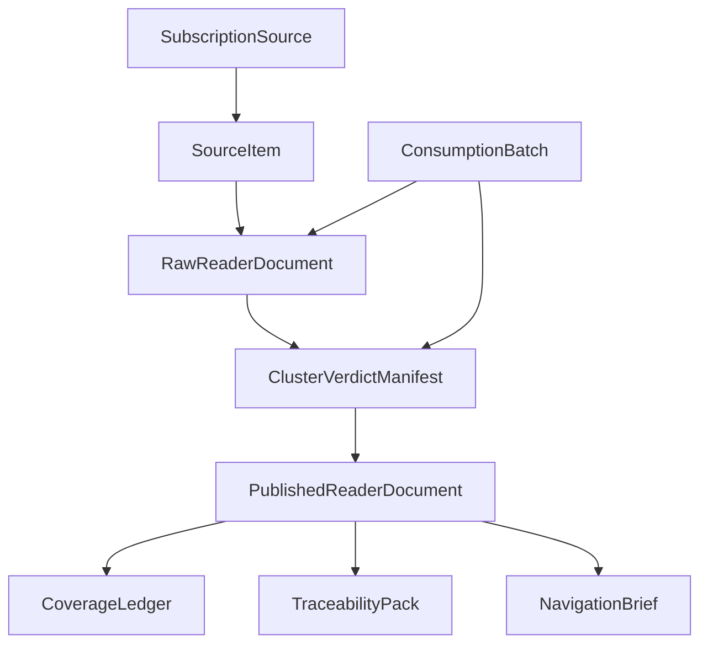

# 2026-04-09 Reader Product Object Contract

状态：`W1-A` canonical object contract。
用途：冻结 reader-product program 的对象列表、对象边界、对象命名、ownership、最小字段与最小状态；供 `W1-B ~ W5` 直接引用。
边界：本文是 **target contract addendum**，不是 current capability claim；不替代 [2026-04-08-reader-product-system-blueprint.md](./2026-04-08-reader-product-system-blueprint.md) 的系统总图。

依赖先读：

- `AGENTS.md`
- `docs/start-here.md`
- `docs/architecture.md`
- `docs/project-status.md`
- `.agents/Tasks/TASK_BOARD-4月8日-阅读器产品与无损合并主线.md`
- `docs/blueprints/2026-04-08-reader-product-system-blueprint.md`
- `.agents/Plans/2026-04-08__sourceharbor-reader-product-wave-program.md`
- `.agents/Plans/2026-04-08__sourceharbor-reader-product-context-index.md`

谁应先读我：

- `W1-B` worker
- 任意要做 `W2-W5` 的 worker
- 任意要给后续 worker 写 handoff prompt 的 planner/orchestrator

## 1. 本文职责与边界

这份文档解决的不是“功能怎么实现”，而是“后面所有人讨论的是不是同一组对象”。

说得更直白一点：

- system blueprint 像城市总图，告诉你城市有哪几片区
- 本文像地籍图，告诉你每块地到底是谁的、边界在哪、不能混建什么

`W1-A` 在这里正式冻结：

1. canonical object list
2. 每个对象的 definition / non-definition
3. owner / producer / consumer / mutability boundary
4. object 所在层：DB / artifact / runtime payload / UI companion
5. minimum required fields
6. minimum states
7. naming / alias / deprecation rules
8. `manual source intake` 对对象层的影响

`W1-A` **不**在这里最终拍板：

- `window_id` 最终命名格式
- `cutoff_at` 最终计算细节
- stable key 的最终字符串格式
- version bump 规则
- `published_with_gap` 的状态跃迁细节
- yellow warning 的最终 UI 语义
- traceability companion payload 的精确 JSON schema

这些统一留给 `W1-B finalizes this`。

## 2. 与 System Blueprint 的关系

[2026-04-08-reader-product-system-blueprint.md](./2026-04-08-reader-product-system-blueprint.md) 负责回答：

- 这个产品想成为什么
- 总流水线怎么走
- reader-first 为什么成立

本文负责回答：

- 世界里到底有哪些对象
- 这些对象谁创建、谁消费、谁允许改
- 哪些只是 current repo 的相邻影子，哪些才是正式对象

使用规则：

- system blueprint 优先讲系统图
- object contract 优先讲对象边界
- 如果两者冲突，以本文对对象定义的最新冻结为准，并回写 lower-priority surface

## 3. `W1-A` / `W1-B` Scope Split

| 主题 | `W1-A` 冻结什么 | `W1-B` 最终拍板什么 |
| --- | --- | --- |
| 对象列表 | 8 个核心对象 + `TraceabilityPack` companion payload 定位 | 不新增业务对象 |
| 边界 / ownership | definition / non-definition / producer / consumer / mutability | 不重定义对象，只补版本与缺口细节 |
| 层级 | DB / artifact / runtime payload / UI companion | 不改层级，只补 schema 细节 |
| 最小字段 | 每对象的 minimum required fields | 字段命名、字段格式、索引/键细节 |
| 最小状态 | 每对象的 minimum states | 精确跃迁规则、失败语义、version semantics |
| batch/version | 只冻结 `ConsumptionBatch` 存在性与最小字段 | `window_id`、`cutoff_at`、stable key、version bump |
| gap / warning | 只冻结 `PublishedReaderDocument` 可进入 `published_with_gap` | yellow warning 呈现、gap transition、repair interaction |
| traceability | 冻结为 `PublishedReaderDocument` companion payload | 最终 companion payload schema 与 UI contract |

一句话总结：

> `W1-A` 先把“对象存在性”钉死；
> `W1-B` 再把“对象怎么编号、怎么版本化、缺口怎么讲”钉死。

## 4. Canonical Object Table

| 对象 | 层级 | 主职责 | 主要存放层 | 当前 repo 最近邻锚点 |
| --- | --- | --- | --- | --- |
| `SubscriptionSource` | `L1` | 长期订阅的源头 | DB-first | `apps/api/app/models/subscription.py:21-68` |
| `SourceItem` | `L2` | 一条具体更新 | DB-first | `apps/api/app/models/video.py:13-33`, `apps/api/app/models/ingest_run.py:69-128` |
| `RawReaderDocument` | `L3` | 单信息源高保真抽取文档 | artifact-first + DB linkage | `apps/worker/worker/pipeline/steps/artifacts.py:385-452` |
| `ConsumptionBatch` | `L3-L4 bridge` | 冻结一次消费的输入集合 | DB-first + runtime payload | 当前 `apps/contracts/config` 尚无正式对象；最近邻是 intake-side `IngestRun` |
| `ClusterVerdictManifest` | `L3-L4 bridge` | 记录 judge 的聚类判决 | artifact/DB companion | 当前 `apps/contracts/config` 尚无正式对象；最近邻是 `merged_stories` view |
| `PublishedReaderDocument` | `L4` | 面向读者的正式成品文档 | artifact/DB metadata + UI payload | 当前尚无正式对象；最近邻是 `apps/api/app/services/watchlists.py:741-817` 的 view-level story aggregation |
| `CoverageLedger` | `L4 audit` | 记录 source item 覆盖情况 | audit artifact / DB companion | 当前 `apps/contracts/config` 尚无正式对象；最近邻是 topic/claim diff summaries |
| `NavigationBrief` | `L5` | 对当天成品层做导航摘要 | artifact/UI payload | current code absent; nearest old digest workflow = `apps/worker/worker/temporal/workflows.py:186-240` |
| `TraceabilityPack` | companion payload | 供 drawer / audit / MCP 使用的来源贡献包 | UI companion / audit payload | current code absent in `apps/contracts/config` |

## 5. Per-Object Contract

### 5.1 `SubscriptionSource`

它是什么：

- 一个持续产出更新的长期来源
- 一个用户愿意持续跟踪的 source identity

它不是什么：

- 不是一次具体更新
- 不是一篇给人读的文档
- 不是“手动加进今天消费层的一次性 URL”

| 项目 | 冻结结论 |
| --- | --- |
| owner | intake / subscription management layer |
| producer | Web `/subscriptions`、API `/api/v1/subscriptions`、MCP subscription tools |
| consumer | Track Lane、subscription 管理 UI、future source-level analytics |
| 允许修改者 | 用户显式配置、受控系统同步 |
| 主要表示层 | DB row；必要时有 API/MCP payload |
| minimum required fields | `subscription_source_id`, `platform`, `source_type`, `source_value`, `adapter_type`, `source_url`, `content_profile`, `enabled` |
| minimum states | `active`, `disabled` |
| `W1-B` 保留项 | source identity normalization、URL/handle canonicalization 细则 |

### 5.2 `SourceItem`

它是什么：

- 某个时间点进入系统的一条具体内容更新
- merge / polish / coverage 的最小输入单位

它不是什么：

- 不是订阅源本身
- 不是最终读者成品
- 不是只能来自订阅流

| 项目 | 冻结结论 |
| --- | --- |
| owner | tracking / intake substrate |
| producer | Track Lane pollers、`manual source intake` |
| consumer | Source Extractor、Cluster Judge、current jobs/feed/job trace surfaces |
| 允许修改者 | 系统只允许追加 metadata / processing state；不改 source identity |
| 主要表示层 | DB row；当前 repo 最近邻为 `videos` + `ingest_run_items` split |
| minimum required fields | `source_item_id`, `source_origin`, `subscription_source_id?`, `platform`, `content_type`, `source_url`, `title?`, `published_at?`, `discovered_at`, `content_fingerprint?`, `status` |
| minimum states | `discovered`, `raw_ready`, `batch_assigned`, `published` |
| `W1-B` 保留项 | exact identity rules、dedupe key、time-window assignment details |

`source_origin` 在 `W1-A` 先冻结成两类：

- `subscription_tracked`
- `manual_injected`

### 5.3 `RawReaderDocument`

它是什么：

- 单个 `SourceItem` 的高保真抽取文档
- 后续 judge / merge / polish 的标准输入

它不是什么：

- 不是最终给读者的成品层
- 不是只剩摘要的轻量卡片
- 不是 `knowledge_cards` 的别名

| 项目 | 冻结结论 |
| --- | --- |
| owner | Source Extractor / extraction pipeline |
| producer | `Stage 1. Source Extractor` |
| consumer | Cluster Judge、Merge Writer、Polish Writer、retrieval/indexing |
| 允许修改者 | 只允许通过新 extraction version 重生；不允许被下游自由覆盖 |
| 主要表示层 | artifact-first，DB 通过 `artifact_root` / `artifact_digest_md` 关联 |
| minimum required fields | `raw_doc_id`, `source_item_id`, `artifact_root`, `digest_markdown`, `outline_ref`, `transcript_ref`, `comments_ref`, `frame_manifest`, `reader_output_locale`, `reader_style_profile`, `extract_status`, `degradation_summary?` |
| minimum states | `pending`, `ready`, `degraded`, `failed` |
| `W1-B` 保留项 | extraction version key、artifact manifest exact schema |

### 5.4 `ConsumptionBatch`

它是什么：

- 一次消费时刻被冻结的输入集合
- 用来告诉 judge / writer：这次你只能吃这些，不要把新来的条目偷偷算进去

它不是什么：

- 不是 Track Lane 的发现记录
- 不是长期主题档案
- 不是 published doc 本身

| 项目 | 冻结结论 |
| --- | --- |
| owner | Consume Lane orchestration |
| producer | 用户显式 consume 或 auto consume scheduler |
| consumer | Cluster Judge、Merge Writer、version/gap policy |
| 允许修改者 | 创建后输入集合不可变；只允许状态前进 |
| 主要表示层 | DB row + runtime payload |
| minimum required fields | `consumption_batch_id`, `window_id`, `cutoff_at`, `source_item_ids`, `base_published_doc_versions`, `trigger_mode`, `status` |
| minimum states | `frozen`, `judged`, `materialized`, `closed` |
| `W1-B` 保留项 | `window_id` / `cutoff_at` exact format、batch/version interaction |

### 5.5 `ClusterVerdictManifest`

它是什么：

- judge 对一个 batch 的聚类判决书
- 告诉下游哪些 merge，哪些 `polish_only`

它不是什么：

- 不是最终读者文档
- 不是 watchlist trend view
- 不是只存在于 prompt 里的临时 JSON

| 项目 | 冻结结论 |
| --- | --- |
| owner | Cluster Judge |
| producer | `Stage 2. Cluster Judge` |
| consumer | Merge Writer、Polish Writer、Coverage Auditor、Traceability Packer |
| 允许修改者 | append-only by new manifest version |
| 主要表示层 | artifact/DB companion |
| minimum required fields | `manifest_id`, `consumption_batch_id`, `window_id`, `cluster_entries[]`, `singleton_entries[]`, `judge_model`, `status` |
| minimum states | `draft`, `final` |
| `W1-B` 保留项 | cluster stable key format、incremental re-judge versioning |

### 5.6 `PublishedReaderDocument`

它是什么：

- 最终给读者阅读的正式对象
- merge 产生的文章和单身 polish 文，在展示层一视同仁

它不是什么：

- 不是 current repo 的 `merged stories` 聚合 view
- 不是单源 `digest.md` 的别名
- 不是 watchlist briefing page payload

| 项目 | 冻结结论 |
| --- | --- |
| owner | reader publish layer |
| producer | Merge Writer + Polish Writer，或 `polish_only` path |
| consumer | reader UI、MCP/API published-doc surfaces、Navigation Brief、auditors |
| 允许修改者 | 每个 version immutable；新版本替代旧版本，不原地覆写 |
| 主要表示层 | artifact + DB metadata + UI payload |
| minimum required fields | `published_doc_id`, `stable_key`, `version`, `window_id`, `cluster_id?`, `source_item_ids`, `render_markdown`, `reader_output_locale`, `reader_style_profile`, `publish_status` |
| minimum states | `draft`, `published`, `published_with_gap`, `superseded` |
| `W1-B` 保留项 | stable key 命名、version bump、yellow warning semantics |

### 5.7 `CoverageLedger`

它是什么：

- 一份检查“有没有丢信息”的审计账本
- 它不是 moral slogan，而是 Repair Writer 的输入

它不是什么：

- 不是 reader UI 文档
- 不是 traceability drawer payload
- 不是 judge manifest

| 项目 | 冻结结论 |
| --- | --- |
| owner | Coverage Auditor |
| producer | `Coverage Auditor` |
| consumer | Repair Writer、yellow warning policy、proof/docs truth |
| 允许修改者 | append-only per published doc version |
| 主要表示层 | audit artifact / DB companion |
| minimum required fields | `coverage_ledger_id`, `published_doc_id`, `source_item_id`, `required_topics`, `covered_topics`, `missing_topics`, `status` |
| minimum states | `pending`, `pass`, `gap_detected`, `repair_exhausted` |
| `W1-B` 保留项 | topic/claim granularity schema、budget counters、state transitions |

### 5.8 `NavigationBrief`

它是什么：

- 对当天 `PublishedReaderDocument[]` 的导航摘要
- 只回答“今天该读什么”，不替代正文

它不是什么：

- 不是 daily report 风格的 operator report
- 不是 watchlist trend timeline
- 不是长文合并稿

| 项目 | 冻结结论 |
| --- | --- |
| owner | navigation layer |
| producer | `Stage 5. Navigation Brief Writer` |
| consumer | reader 首页、future email/MCP automation |
| 允许修改者 | 每版 brief immutable |
| 主要表示层 | artifact / UI payload |
| minimum required fields | `navigation_brief_id`, `window_id`, `published_doc_ids`, `summary_markdown`, `reader_output_locale`, `status` |
| minimum states | `draft`, `published`, `superseded` |
| `W1-B` 保留项 | daily snapshot key、delivery channel policy |

### 5.9 `TraceabilityPack`

`TraceabilityPack` 在 `W1-A` 的正式结论是：

> 它不是第九个业务主对象；
> 它是 `PublishedReaderDocument` 的 companion payload。

理由：

- 读者主产品看的不是 traceability 本身，而是正文
- traceability 的职责是给 drawer / audit / MCP 用
- 把它抬成独立主对象，会让展示层和审计层重新混在一起

| 项目 | 冻结结论 |
| --- | --- |
| owner | Traceability Packer |
| producer | `Traceability Packer` |
| consumer | drawer、MCP、audit |
| 允许修改者 | 只随 published doc version 生成对应 companion payload |
| 主要表示层 | UI companion / audit payload |
| minimum required fields | `published_doc_id`, `section_contributions[]`, `source_item_map`, `evidence_routes`, `status` |
| minimum states | `pending`, `ready`, `gap_detected` |
| `W1-B` 保留项 | exact JSON schema、drawer payload contract |

## 6. Canonical Relationship Graph



冻结结论：

- `SubscriptionSource -> SourceItem`
- `SourceItem -> RawReaderDocument`
- `ConsumptionBatch -> RawReaderDocument[]`
- `ClusterVerdictManifest -> cluster memberships`
- `PublishedReaderDocument -> source items / clusters / traceability companion`
- `CoverageLedger -> PublishedReaderDocument`
- `NavigationBrief -> PublishedReaderDocument[]`

## 7. Naming / Alias / Deprecation Table

### 7.1 可保留但需重新定义的词

| 现有词 | 新处理方式 | 原因 |
| --- | --- | --- |
| `subscription` | 在 reader-product program 里统一写成 `SubscriptionSource` | 避免把长期源和一次更新混成一件事 |
| `video` / `article` | 在对象层统一视作 `SourceItem` 的 `content_type` | 允许视频/文章混合聚类，只按主题判 |
| `digest` / `artifact markdown` | 只在 current code truth 层指单源产物；对象层统一叫 `RawReaderDocument` | 避免把单源提取文和最终成品文混成一层 |
| `traceability` | 对象层写 `TraceabilityPack` companion payload | 避免把审计层误抬成主产品对象 |

### 7.2 需要 alias 解释的词

| 现有词 | canonical handling | 为什么不能直接沿用 |
| --- | --- | --- |
| `merged story` | 当前 truth 里保留为现有聚合 view；目标对象层不要把它当 `PublishedReaderDocument` | 它现在只是 story aggregation，不是正式成品文档 |
| `story payload` / `selected-story payload` | 视作 current `/briefings` / `/ask` 页面 payload，不等于 future published-doc schema | 容易把 current compounder surface 误说成 reader final object |
| `operator command center` / `operator boot path` | 只在 current truth 使用；目标产品层不要当 reader 主语 | 它描述当前 repo，不描述 reader-product 目标 |
| `knowledge cards` | 视作辅助证据层，不是 merge 输入 contract 的唯一来源 | 当前 view-level merge heavily depends on cards，容易污染 no-loss contract |

### 7.3 应避免继续使用的 legacy 词

| 词汇 | handling rule | 风险 |
| --- | --- | --- |
| `Mainline A / Mainline B` | 只允许带 `legacy` 前缀出现在历史回顾里 | 会把旧 closeout program 混进新 reader-product reset |
| `Wave A-F` | 同上 | 会污染新 `W0-W5` 语义 |
| 旧 `Wave 0-4` | 同上 | 会让后续 worker 错读依赖顺序 |
| `P1 / P2 / P3` | 同上 | 是 recent archive 的 active schema，不是当前 reader-product 波次语义 |
| `Prompt 5 / Prompt 7 / Prompt 8` | 同上 | 只代表历史 thread，不代表当前执行阶段 |

## 8. `manual source intake` 对对象层的影响

`manual source intake` 在 `W1-A` 里的正式结论不是“以后再想”，而是已经进入对象 contract：

1. `SourceItem` 的来源不只一种。
2. 系统必须允许：
   - `subscription_tracked`
   - `manual_injected`
3. `manual_injected SourceItem` 进入消费层后，与订阅流一视同仁。
4. `manual_injected SourceItem` 不要求先绑定 `SubscriptionSource`。
5. 它可以后续再被升级/绑定为订阅源，但这不是前置条件。

这条规则改变的是对象边界，不只是 UI 入口：

- `SubscriptionSource` 不再是 `SourceItem` 的唯一来源
- `SourceItem` 变成 intake 的统一币种
- 后续 batch / judge / merge / polish 都必须对两类来源统一处理

## 9. Current Code Anchor Table

### 9.1 当前对象锚点

| canonical object | 当前最近邻锚点 | 解释 |
| --- | --- | --- |
| `SubscriptionSource` | `apps/api/app/models/subscription.py:21-68`, `apps/api/app/routers/subscriptions.py:23-220`, `apps/api/app/services/subscription_templates.py:9-99` | 当前 subscriptions 已经是稳定 DB/API/template catalog 对象 |
| `SourceItem` | `apps/api/app/models/video.py:13-33`, `apps/api/app/models/ingest_run.py:69-128` | 当前 source item 语义分散在 `videos` 和 `ingest_run_items`；还没有统一命名的 canonical object |
| `RawReaderDocument` | `apps/worker/worker/pipeline/steps/artifacts.py:385-452`, `apps/api/app/services/jobs.py:429-453`, `apps/api/app/routers/artifacts.py:23-63`, `apps/web/components/reading-pane.tsx:91-103` | 当前单源 digest/artifact/read path 已真实存在 |
| `PublishedReaderDocument` 相邻 surface | `apps/api/app/services/watchlists.py:741-817`, `apps/web/app/trends/page.tsx:89-129` | 当前只有 merged story / trend view-level aggregation，没有正式 published-doc object |
| `TraceabilityPack` 相邻 surface | `apps/api/app/services/watchlists.py:614-639`, `apps/api/app/services/watchlists.py:672-725` | 当前只有 routes/evidence cards/drawer-like payload 影子，没有正式 companion payload |
| Track/Consume current coupling | `apps/api/app/services/ingest.py:24-160`, `apps/worker/worker/temporal/workflows.py:27-53` | 现在 poll 会直接 dispatch process workflow，尚未拆 lane |
| `manual source intake` 相邻 surface | `config/source-templates/subscriptions.intake_templates.json:21-96`, `apps/web/app/subscriptions/actions.ts:30-67` | 当前只有 subscription/front-door intake；没有独立 manual-injected path |
| current MCP scope | `apps/mcp/server.py:780-792` | 现有 tool family 未注册 watchlists / trends / briefings / published-docs |

### 9.2 命名漂移证据

| 证据 | 说明 |
| --- | --- |
| `.agents/Tasks/TASK_BOARD-4月8日-阅读器产品与无损合并主线.md:65-78` | 已明确区分 reader-facing surfaces 与 `operator command center` current truth，并指出 merged story 只是 view |
| `.agents/Tasks/TASK_BOARD-4月8日-阅读器产品与无损合并主线.md:184-186` | 已明确点名 `Mainline A/B`、`Wave A-F`、旧 `Wave 0-4`、`Prompt 5-8` 是 legacy pollution |
| `.agents/Plans/2026-04-08__sourceharbor-reader-product-context-index.md:121-140` | 已明确列出不要继续沿用的 stage labels |
| `docs/architecture.md:67-81` | current highest-priority public system map 仍把 Web 主面表述成 operator command center |
| `README.md:137-145` | current front door 仍把 `/briefings` / `/trends` / `/watchlists` 作为 existing compounder surfaces，对应的是 current truth，不是 final published-doc object |

### 9.3 负搜索证据

对当前实现面做 exact-term 负搜索：

```bash
rg -n "ClusterVerdictManifest|PublishedReaderDocument|CoverageLedger|NavigationBrief|TraceabilityPack|manual_injected|subscription_tracked|ConsumptionBatch" apps contracts config
```

本轮结果：**no hits**。

这代表：

- 这些对象已经在 W0/W1 文档层被定义
- 但在 current code / contracts / config 层还没有正式落成 first-class runtime objects

这也是为什么 `W1-A` 必须先锁 object contract，再让 `W1-B ~ W5` 去实现。

## 10. What Remains For `W1-B`

`W1-B` 必须最终冻结的内容：

1. `window_id` 的最终生成规则
2. `cutoff_at` 的最终计算细节
3. stable key 的最终命名格式
4. version bump 规则
5. `published_with_gap` 的状态跃迁细节
6. yellow warning 的最终行为语义
7. `TraceabilityPack` companion payload 的最终 JSON schema
8. `ConsumptionBatch` 与 version / rejudge / rebuild 的交互规则
9. `Patch Repair` / `Section Rebuild` / `Cluster Rebuild` 的精确触发条件

`W1-A` 已经为这些问题提供了对象边界，但不替 `W1-B` 提前拍死实现细节。

## 11. Explicit Non-Goals

本文明确不做：

- DB migration
- ORM model implementation
- API route implementation
- MCP tool implementation
- Web UI implementation
- Track/Consume runtime split code
- Cluster Judge / Merge Writer / Polish Writer / Repair Writer runtime code
- yellow warning UI code
- manual source intake UI/interaction code

一句话收尾：

> `W1-A` 的交付物不是“把阅读器做出来”，
> 而是确保后面所有人做的是**同一套对象世界观**。
